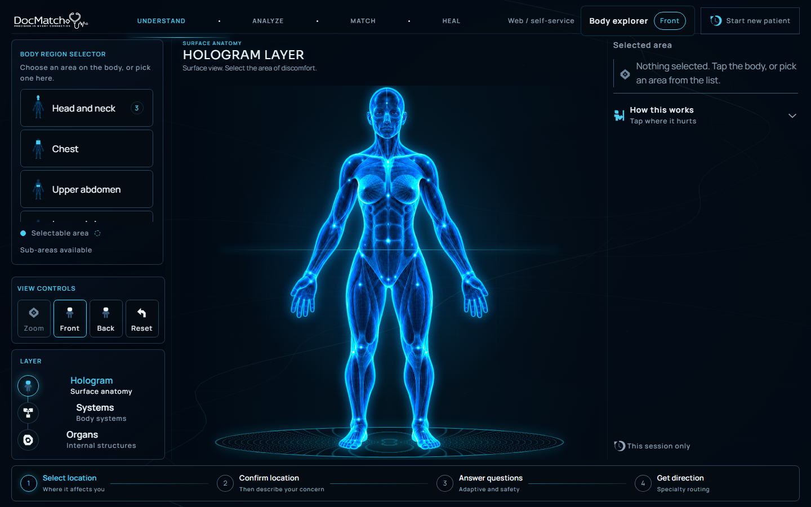
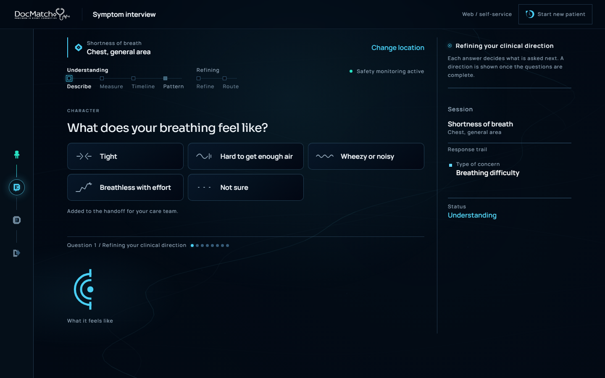
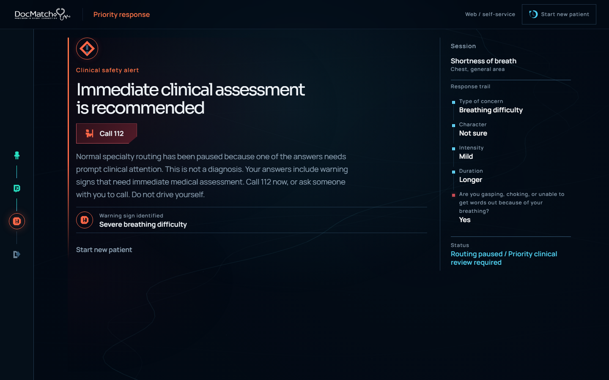
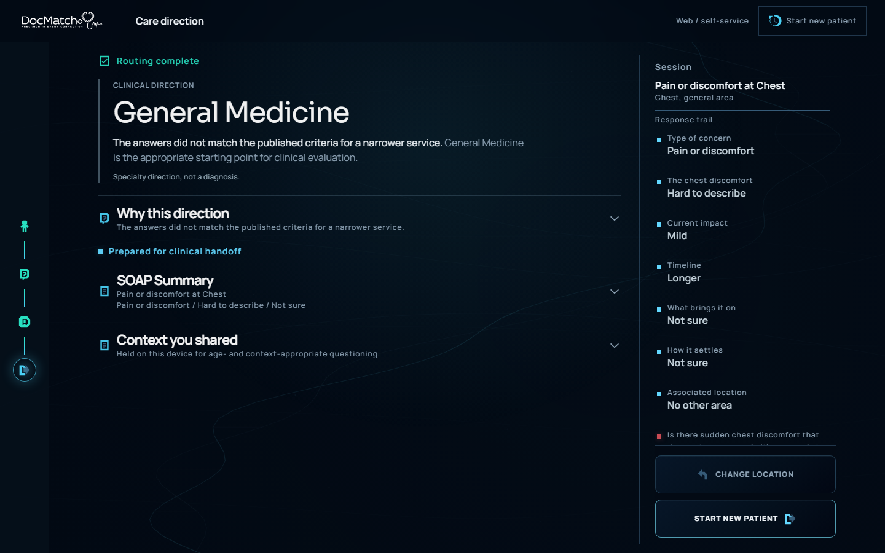

# DocMatch+

*Where symptoms begin, care finds its direction.*

DocMatch+ is a body-first patient assessment prototype. It helps a person describe a concern, asks relevant follow-up questions, checks defined warning signs, and prepares a specialty direction with a structured handoff for clinical review. **It provides a specialty direction, not a diagnosis.**

**[Explore the live prototype →](https://docmatch-plus.vercel.app)** · Research / engineering prototype



## Overview

A patient may know *where* something feels wrong without knowing the medical term or which department to approach. DocMatch+ begins with that familiar signal. Its adaptive intake organizes patient-reported context before handing a clearer account to a care team. The interface separates ordinary specialty routing from safety checks that can call for urgent attention.

## The problem

Early intake can require a patient to choose a specialty before their concern has been understood. Repeating an unstructured symptom story can also lose useful details between the patient and clinician. DocMatch+ explores whether a body-first, structured conversation can make that first handoff clearer while keeping clinical judgment with professionals.

## How DocMatch+ works

```text
BODY → CONCERN → ADAPTIVE QUESTIONS → PARALLEL SAFETY
                                   → SPECIALTY DIRECTION → STRUCTURED HANDOFF
```

The body/face selection records a semantic location; it does not decide the specialty by itself. Answers shape the next question. Safety rules run alongside the interview and can interrupt ordinary routing. A completed result explains the direction and prepares a SOAP-style summary for review.

## Product experience

These screenshots come from a synthetic walkthrough. They contain no real patient information or staff credentials.

| Adaptive questionnaire | Safety escalation |
| --- | --- |
|  |  |



The journey includes age-aware intake, accessibility and medical-background context, front/back body exploration, face detail, concern selection, adaptive questions, a result explanation, and a clinician-facing handoff. A separate facility-scoped staff workspace can review prepared handoffs.

## Key features

- Body-first selection with semantic body and face regions, patient-relative laterality, and keyboard-accessible controls.
- Adaptive questioning based on prior answers, with the response trail kept visible.
- Parallel urgent-review and hard-stop safety presentation.
- A guarded General Medicine or Paediatrics fallback when a narrower direction is not supported.
- A structured SOAP-style handoff that distinguishes patient report, captured context, routing assessment, and next step.
- Separate patient and staff trust boundaries, including facility-scoped handoff access.

## Routing and safety

**No LLM or ML model makes routing or safety decisions in DocMatch+.** The engine combines explicit deterministic rules and specialty criteria gates with a demonstration probabilistic component. That component uses Bayesian belief updating and expected information gain to choose questions. Its numerical priors, likelihoods, and stopping parameters are **not clinically calibrated**.

Safety checks are explicit rules evaluated separately from specialty direction. An urgent-review finding may allow the interview to continue; a hard stop pauses ordinary routing and presents immediate guidance. Neither outcome is a diagnosis. The care team remains responsible for examination, investigations, treatment, and final clinical judgment.

## Architecture

```text
Patient browser ── public React / TypeScript / Vite frontend on Vercel
       │                     │
       │ authenticated       │ browser-safe publishable configuration only
       ▼                     ▼
Supabase Auth ── Edge Functions ── PostgreSQL + row-level security
                      │                       │
                      └─ trusted finalization └─ owner / facility isolation

Staff sign-in ── separate facility-scoped workspace and handoff access
```

The backend recomputes a canonical routing result from persisted assessment context rather than trusting a client-selected specialty or result. Finalization and handoff creation are designed to be atomic and idempotent. The patient flow keeps clinical answers, body selections, results, and SOAP content out of browser persistence; an authorized backend configuration can still store the assessment server-side.

## Security and privacy design

The implemented boundaries include row-level security, facility isolation, server-side result recomputation, tamper rejection, idempotent finalization, Edge rate limiting, and exact allowed browser origins. Privileged server secrets are not embedded in the browser bundle. Application logging is intended to avoid clinical content. These controls reduce risk; they do not establish clinical or regulatory approval.

Please report a suspected vulnerability privately as described in [SECURITY.md](SECURITY.md). Do not test with real patient data.

## Tech stack

| Layer | Technology |
| --- | --- |
| Frontend | React 19, TypeScript, Vite, React Three Fiber / Three.js, Framer Motion |
| Backend | Supabase Auth and Edge Functions |
| Database | PostgreSQL with row-level security |
| Deployment | Vercel frontend; the private engineering repository remains its deployment source |
| Verification | Node/TypeScript tests, Playwright, ESLint, GitHub Actions |

## Engineering verification

The source snapshot has been exercised with **483 frontend tests** and **79 backend tests**, adversarial security tests, controlled multi-user concurrency tests, cross-browser checks, and accessibility checks. The CI release gate builds and tests without live production credentials or deployment permissions. A dependency audit reported **0 vulnerabilities** at publication.

These are engineering checks, **not clinical accuracy measurements**. They do not establish sensitivity, specificity, safety in real-world care, or clinical validation.

## Getting started

Use Node 24 (see [`.nvmrc`](.nvmrc)) and npm:

```bash
npm ci
cp .env.example .env.local
npm run dev
```

On Windows PowerShell, use `Copy-Item .env.example .env.local` instead of `cp` if preferred. With the Supabase URL and publishable key left empty, the patient walkthrough runs locally without backend persistence. Use only a backend you control and synthetic data when testing a configured deployment.

Useful checks:

```bash
npm run build
npx tsc -p tsconfig.functions.json --noEmit
npx tsx --test "src/**/*.test.ts"
npx tsx --test supabase/functions/tests/*.test.ts
npm audit --audit-level=high
```

The public CI also lints changed JavaScript and TypeScript files. The inherited full-tree `npm run lint` command is not used as a release gate for this snapshot because untouched legacy files have existing lint findings.

### Environment variables

Every `VITE_*` value is embedded in browser assets and must be treated as **public**. Never place a service-role key, database password, staff password, or token there.

| Variable | Boundary | Purpose |
| --- | --- | --- |
| `VITE_DEPLOYMENT_MODE` | Public / browser | Presentation mode; the example defaults to `web/self-service` |
| `VITE_KIOSK_IDLE_WARNING_MS`, `VITE_KIOSK_IDLE_RESET_MS` | Public / browser | Optional kiosk timing |
| `VITE_SUPABASE_URL`, `VITE_SUPABASE_PUBLISHABLE_KEY` | Public / browser | Optional configured Auth and persistence |
| `DOCMATCH_ALLOWED_ORIGINS` | Server only | Exact origins accepted by Edge Functions |
| `DOCMATCH_RATE_LIMIT_KEY` | Server only | Edge rate-limiting configuration |
| `SUPABASE_SERVICE_ROLE_KEY` / `SUPABASE_SECRET_KEYS` | Server only | Privileged backend configuration; never commit values |

The example file contains no credentials. Deployment owners must configure server-only values through their own secret-management system.

## Project structure

```text
src/body/               Semantic body-region model
src/engine/             Adaptive questioning, routing, safety
src/features/           Patient flow, persistence client, staff workspace
supabase/functions/     Trusted backend operations
supabase/migrations/    Versioned schema
supabase/tests/         Database security and contract checks
docs/media/             Inspected synthetic product screenshots
.github/workflows/      Non-deploying public CI
```

## Deployment

The live prototype is hosted at [docmatch-plus.vercel.app](https://docmatch-plus.vercel.app). Vercel serves the frontend; Supabase provides Auth, Edge Functions, and PostgreSQL. This **public repository is a curated source snapshot**, not the Vercel deployment source. Deployment remains connected to the separate private engineering repository. No public CI workflow deploys or mutates Supabase.

## Current status and limitations

DocMatch+ is a **research / engineering prototype**. It is engineering-tested, but **clinical validation is still required before real-patient deployment**. Its directions and safety prompts must not replace qualified clinical assessment or an emergency service.

Before any real-patient use, the project needs independent clinical governance review, an approved retention/deletion policy, tested backup and recovery arrangements, and production error monitoring with operational ownership. No retention duration is asserted here.

## Future scope

Potential future work—not implemented or promised in this prototype—includes HL7/FHIR and EMR/EHR integration, multilingual voice interaction, kiosk/offline resilience, per-hospital configuration, clinician-reviewed scope expansion, and privacy-safe aggregate analytics.

## Team

- **Sreehitha** — Product / System Design / Clinical-UX Architecture
- **Dipesh** — Prototype Engineering

## AI-assisted development

AI-assisted coding, design, and research tools were used extensively. The team owns the problem selection, architecture, product decisions, body-first UX, routing and safety scope, source selection, backend/security decisions, testing and evaluation, and final implementation choices. DocMatch+ itself uses **no LLM/ML model for routing or safety decisions**.

## License

No open-source license has been selected yet. Public visibility does not grant permission to reuse, modify, or redistribute the source.
