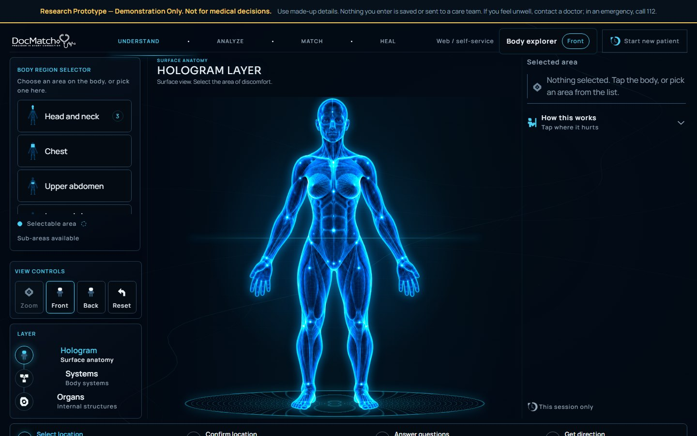
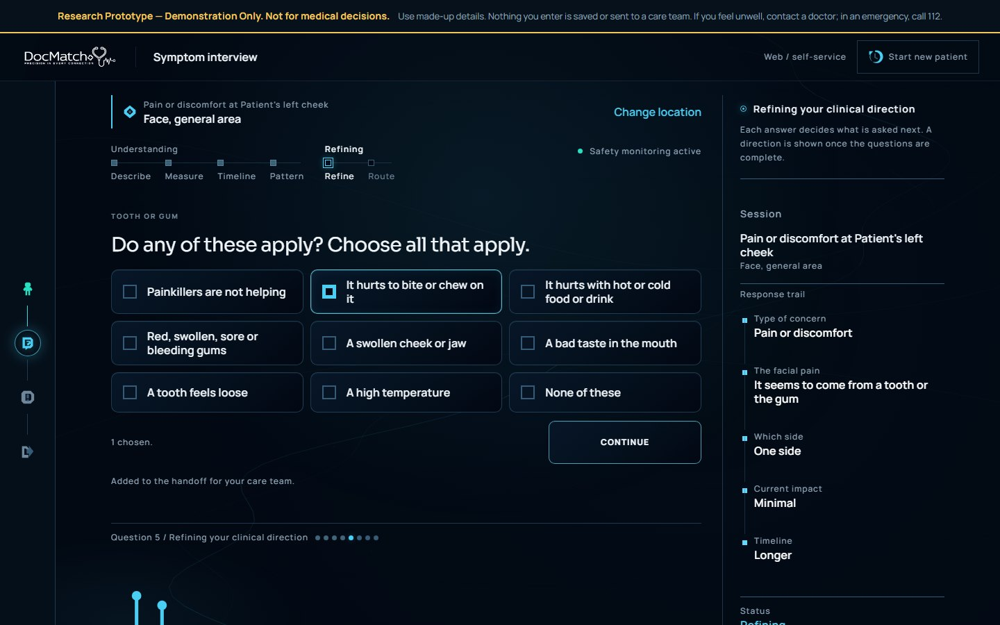
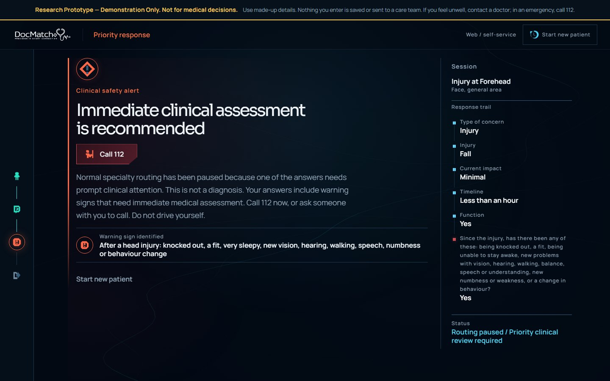
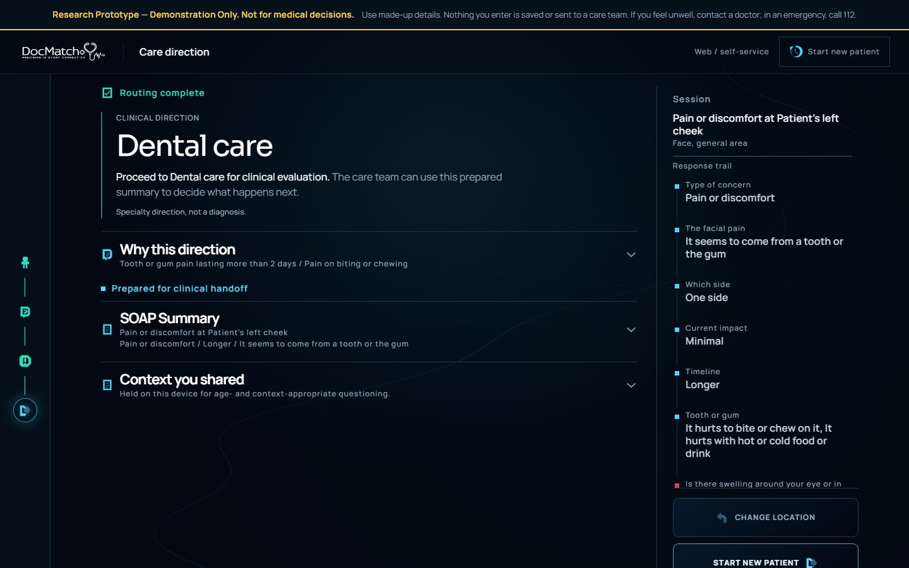

# DocMatch+

*Where symptoms begin, care finds its direction.*

> **Research Prototype — Demonstration Only. Not for medical decisions.**
> No qualified clinical validation has been completed. The live demonstration stores nothing and sends nothing to a care team; use made-up details.

DocMatch+ is a body-first patient assessment prototype. A person shows *where* something is wrong, answers a short adaptive questionnaire, is screened for defined warning signs throughout, and receives a suggested first specialty direction with a structured SOAP-style handoff. **It suggests a direction, never a diagnosis.**

**[Try the live demonstration →](https://docmatch-plus.vercel.app)**



## The problem

Early intake often asks a patient to choose a department before anyone has understood the concern, and an unstructured symptom story loses detail between patient and clinician. DocMatch+ explores whether starting from the body, asking only what the answers make relevant, and handing over a structured summary can make that first step clearer, while keeping every clinical judgment with professionals.

## How it works

```text
BODY / FACE → CONCERN → ADAPTIVE QUESTIONS ──→ SPECIALTY DIRECTION → SOAP HANDOFF
                              │
                              └─ SAFETY SCREENING (runs alongside; can interrupt at any point)
```

1. **Locate.** 32 body regions and 16 face areas, front and back, with patient-relative left and right. The location opens a branch of questions; it never decides a specialty by itself.
2. **Describe.** One question at a time across 22 concern types (pain, injury, swelling or lump, skin, breathing, urinary, bowel, eye, ear, throat, mouth, numbness, weakness and more). Each answer decides what is asked next.
3. **Screen.** Warning-sign checks run in parallel. An *urgent* finding is recorded and the questionnaire continues; an *emergency* finding stops routing immediately and shows a Call 112 action.
4. **Direct.** A specialist direction is shown only when published referral criteria are met. Otherwise the result is General Medicine (adults) or Paediatrics (children), with the reason stated.
5. **Hand off.** A SOAP-style summary separates what the patient reported, what the kiosk captured, the routing rationale and the next step.

## Product experience

Screenshots are from the live demonstration with synthetic answers.

| Adaptive questionnaire | Safety escalation |
| --- | --- |
|  |  |



## Features

- **Interactive body and face selection** with semantic regions, front/back views, keyboard-accessible controls and patient-relative laterality.
- **Adaptive questionnaire.** Concern- and region-specific questions; follow-ups open only when an earlier answer makes them relevant; earlier answers can be corrected from the response trail.
- **Specialty direction** across 15 specialist services (Cardiology, Respiratory Medicine, Neurology, Gastroenterology, Orthopaedics, Rheumatology, Dermatology, ENT, Eye care, Obstetrics and Gynaecology, Urology, Dental care, General Surgery, Vascular Surgery, and Geriatric Medicine for falls at 65 and over) plus the General Medicine and Paediatrics parent services.
- **Parallel safety screening**: 73 explicit rules and 72 safety questions, each tied to a published source and scoped to where it applies (for example head-injury and black-eye signs after a face injury, clot signs with one swollen leg, swallowing problems).
- **Emergency interruption** that pauses routing at once and names the exact sign reported.
- **Structured SOAP handoff** that states which criteria were met, or what stayed uncertain, without naming a condition or a probability.
- **Age-aware intake** with caregiver wording for children and an adult-present acknowledgement under 18.
- **Mobile-responsive and accessible**: checked at 320 to 1440 px widths, at 200% zoom and with reduced motion.
- **Privacy-safe demonstration mode** (see below).

## Questionnaire and routing

**No LLM or ML model makes routing or safety decisions.** Routing combines explicit, source-backed criteria with a demonstration probabilistic component.

- **Concern-specific questioning.** 124 intake concepts, each declaring the history dimension it covers (character, severity, duration, onset, triggers, associated features, function). Across 1,844 location, concern and age combinations, about three quarters of routine journeys ask 6 to 10 questions; emergency paths are kept short on purpose. Every remaining short pathway is documented with its reason.
- **Evidence sufficiency.** A specialist direction needs at least two distinct supporting criteria from its published criteria set, so one answer is never a referral. Exclusions (for example, swelling after an injury for Rheumatology, or pain in one calf for an elective musculoskeletal service) block a direction, and an exclusion that can still be asked is asked first.
- **Competing specialties.** When two different specialist sets are both met, the result is General Medicine with the ambiguity stated, never a forced choice. Adult-only services never route a child.
- **Information-gain question selection.** For the four complaints with a weighted model (headache, breathlessness, upper abdominal pain, joint or muscle pain), Bayesian belief updating orders questions by expected information gain.
- **Bayesian limitations.** The model's priors and likelihoods are demonstration values and are **not clinically calibrated**. It never routes on its own: its answers feed the same published criteria, and it records uncertainty rather than claiming confidence.
- **Guarded fallback.** A parent service always carries a named reason (insufficient evidence, no validated narrower route, an exclusion, genuine ambiguity, or a children's service). A test over every location, concern and age confirms no assessment reaches a parent service while a question that could change the outcome is still unasked.

## Architecture

```text
Browser ── React 19 / TypeScript / Vite frontend (Vercel)
   │
   │  live demonstration: frontend only, persistence disabled in code
   │
   └╌╌ full engineering architecture (implemented in this repository, not used by the demo):
         Supabase Auth ── 9 Edge Functions ── PostgreSQL with row-level security
                               │
                               └─ server-side replay of the same clinical code → canonical result,
                                  SOAP handoff, facility-scoped staff workspace
```

The engineering architecture recomputes the routing result on the server from persisted evidence instead of trusting the browser, with idempotent finalization, facility isolation, rate limiting and exact allowed origins. Its source, migrations and tests are in [`supabase/`](supabase/).

**The live demonstration is frontend-only.** It runs the same clinical code in the browser, but it is built without a database address and its demonstration mode disables persistence and the staff workspace, so no backend is contacted.

## Demonstration mode

Every build is a research-prototype demonstration unless the build environment sets `VITE_DEMO_MODE=off`. In demonstration mode:

- the patient flow never persists, in any deployment mode, even if database variables are present;
- the clinical staff workspace (`/staff`) stays closed;
- answers are never written to localStorage, sessionStorage, IndexedDB or the URL;
- every route shows the research-prototype notice.

These properties are enforced in code and covered by tests (`src/features/tests/demo-mode.test.ts`). The notice is not the safeguard; the disabled persistence is.

## Engineering verification

On the published source (the same code as the live demonstration):

| Check | Result |
| --- | --- |
| Frontend tests | 682 passed |
| Backend tests (trusted operations, clinical parity, rate limiting) | 79 passed |
| TypeScript, production build | Pass |
| `npm audit` | 0 vulnerabilities |
| Browser QA on the live demonstration | Normal, urgent and emergency journeys, a child journey and an older adult's falls journey; 6 viewports from 320×568 to 1440×900; 200% zoom; reduced and full motion; answer correction; zero backend requests |
| Security | Secret scan, no credentials in the bundle, strict CSP and security headers |

The tests include a per-specialty direction matrix (positive, negative, exclusion, competing-service, child and safety cases) and parity tests showing the browser and server reach identical results.

These are engineering checks, **not clinical accuracy measurements**. They show the encoded criteria behave as written; they do not establish sensitivity, specificity or safety in real-world care.

## Clinical limitations

**Research Prototype — Demonstration Only. Not for medical decisions.**

- No qualified clinical validation has been completed. The questionnaire, routing criteria and warning-sign rules are drawn from public NHS and NICE guidance and are **pending clinical review**.
- A direction is a suggested first service, not a diagnosis, triage category or referral.
- Of the 33 services in the registry, 17 are routable. The others stay inactive because their referral criteria rest on tests, imaging or examination, or because they are not kiosk destinations.
- The safety screen covers specific listed signs only. Anyone who feels unwell should contact a doctor; in an emergency, call 112.
- Before any real-patient use the project would need independent clinical governance and sign-off, an approved data retention policy, tested backup and recovery, and production monitoring with operational ownership.

## Getting started

Use Node 24 (see [`.nvmrc`](.nvmrc)) and npm:

```bash
git clone https://github.com/sreehithacyber07/DocMatch-plus.git
cd DocMatch-plus
npm ci
npm run dev
```

The app runs as a local demonstration with no backend. Copying `.env.example` to `.env.local` is optional; leave the Supabase values empty.

Checks:

```bash
npm run build                                   # typecheck + production build
npx tsc -p tsconfig.functions.json --noEmit     # Edge Functions typecheck
npx tsx --test "src/**/*.test.ts"               # frontend tests
npx tsx --test supabase/functions/tests/*.test.ts  # backend unit tests (no live services)
npm audit --audit-level=high
```

The public CI lints changed files rather than the full tree, because some untouched legacy files have existing lint findings.

### Environment variables

Every `VITE_*` value is embedded in browser assets and is **public**. Never put a service-role key, database password or token there.

| Variable | Boundary | Purpose |
| --- | --- | --- |
| `VITE_DEMO_MODE` | Build environment | Demonstration mode; on unless set to `off` |
| `VITE_DEPLOYMENT_MODE` | Public / browser | Presentation mode; the example uses `web/self-service` |
| `VITE_KIOSK_IDLE_WARNING_MS`, `VITE_KIOSK_IDLE_RESET_MS` | Public / browser | Optional kiosk timing |
| `VITE_SUPABASE_URL`, `VITE_SUPABASE_PUBLISHABLE_KEY` | Public / browser | Optional backend for a configured, non-demonstration deployment |
| `DOCMATCH_ALLOWED_ORIGINS`, `DOCMATCH_RATE_LIMIT_KEY` | Server only | Edge Function configuration |
| `SUPABASE_SERVICE_ROLE_KEY` / `SUPABASE_SECRET_KEYS` | Server only | Privileged backend configuration; never commit values |

## Project structure

```text
src/body/               Semantic body and face region model
src/engine/             Bayesian question selection, stopping rules, safety rules (R3)
src/features/           Patient flow, routing criteria, SOAP handoff, persistence client, staff workspace
src/components/         Shared UI, including the demonstration notice
supabase/functions/     Trusted backend operations and their tests
supabase/migrations/    Versioned schema with row-level security
supabase/tests/         Database security and contract checks
docs/media/             Synthetic product screenshots
.github/workflows/      Non-deploying public CI
```

## Deployment

The live demonstration is at [docmatch-plus.vercel.app](https://docmatch-plus.vercel.app). This **public repository is a curated source snapshot** of that demonstration, not its deployment source; deployment runs from a separate private engineering repository. No public workflow deploys anything or contacts a database.

## Future scope

Possible future work, not implemented or promised: clinician-led review and calibration, HL7/FHIR and EMR/EHR integration, multilingual voice interaction, kiosk and offline resilience, per-hospital configuration, and privacy-safe aggregate analytics.

## Team

- **Sreehitha** — Product / System Design / Clinical-UX Architecture
- **Dipesh** — Prototype Engineering

## AI-assisted development

AI-assisted coding, design, and research tools were used extensively. The team owns the problem selection, architecture, product decisions, body-first UX, routing and safety scope, source selection, backend/security decisions, testing and evaluation, and final implementation choices. DocMatch+ itself uses **no LLM/ML model for routing or safety decisions**.

## Security

Please report a suspected vulnerability privately as described in [SECURITY.md](SECURITY.md). Do not test with real patient data.

## License

No open-source license has been selected yet. Public visibility does not grant permission to reuse, modify, or redistribute the source.
